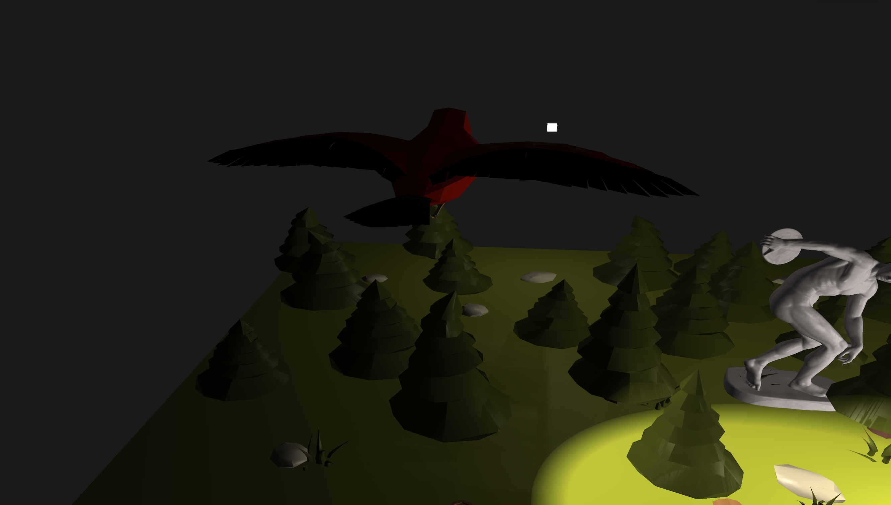
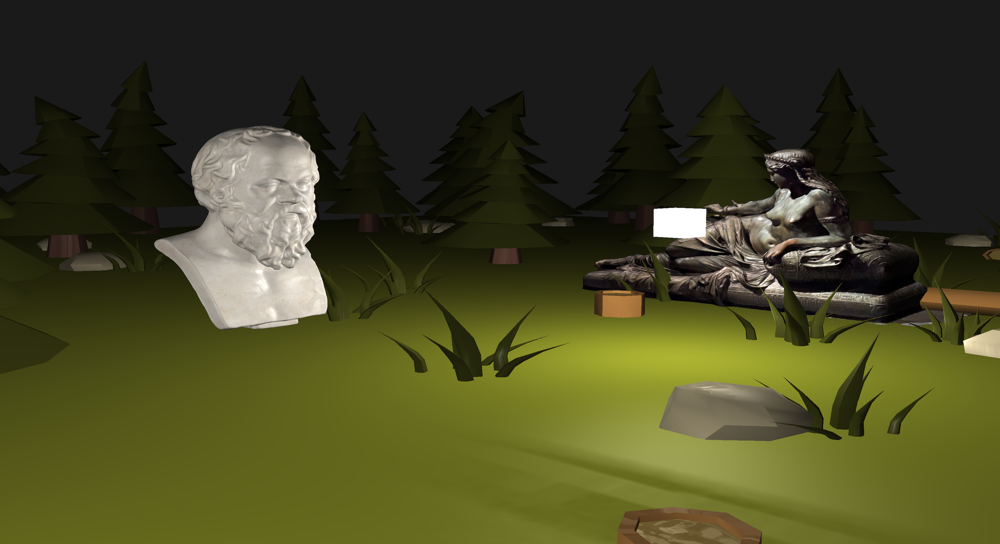
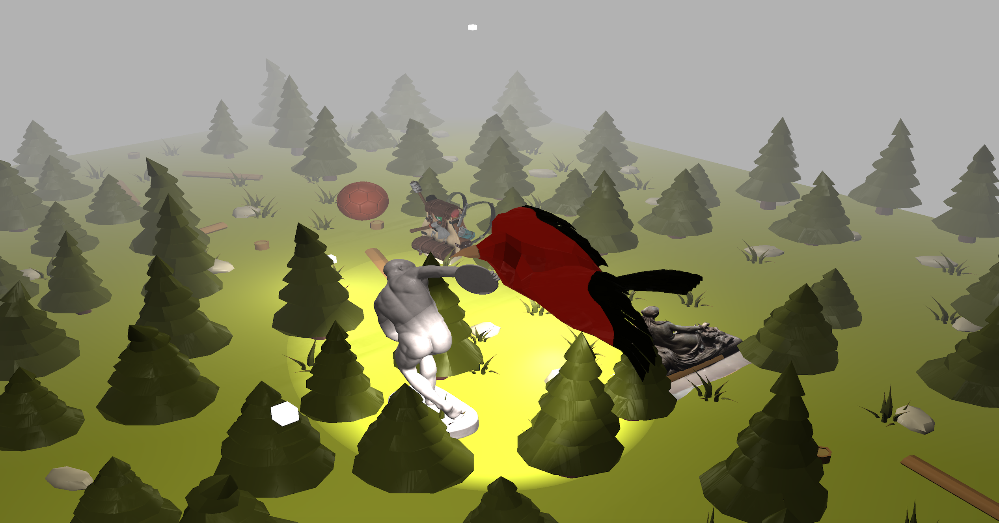

# 🎮 Camera Control & Reflector Instructions

This guide describes the key mappings and functionalities available in the application for controlling the camera, adjusting rendering settings, and moving the reflector.

## ✨ Features & Controls

| **Key**            | **Action**                                  |
|--------------------|---------------------------------------------|
| `1`                | Switch to **Fly Camera**                     |
| `2`                | Switch to **Static Camera**                  |
| `3`                | Switch to **Static Camera (Following Object)** |
| `4`                | Switch to **3rd Person Camera (on Object)**  |
| `M`                | Toggle **Deferred Shading On/Off**           |
| `N`                | Toggle **Night/Day Mode**                    |
| `B`                | Toggle **Orthogonal/Perspective Projection Matrix** |
| Arrow Keys (`↑↓←→`) | **Move Reflector**                          |

